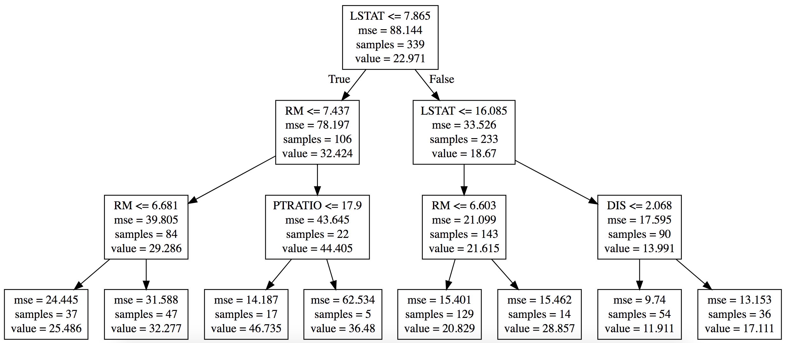
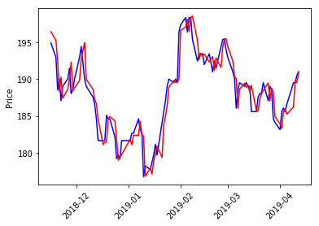
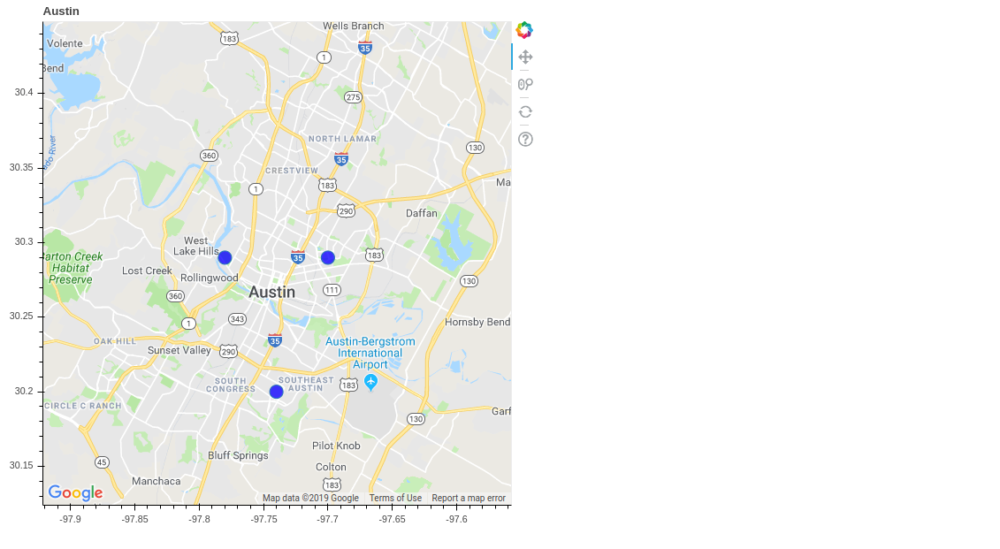

# Tutorials

## 1. Python Fundamentals

* [Basic Numpy](python_fundamentals/basic_numpy.ipynb)
	- สร้าง vector, matrix
	- Indexing
	- Operation บวก, ลบ, คูณ, หาร
	- Operation สำหรับ matrix (Linear algebra function)
	- หาค่าทางสถิติต่าง ๆ
	-  Reshape
	- การสุ่มค่า

* [Regular Expression](python_fundamentals/regular_expression.ipynb)
	- Method ที่ใช้บ่อยใน RE
	- Character พิเศษที่ใช้บ่อยใน RE 
	- Example Use cases
	
* [Data Aaggregation in Pandas](python_fundamentals/data_aggregation_in_pandas.ipynb)
	- Crosstab
	- Group by


## 2. Machine Learning

### 2.1 Fundamentals
* [Decision Tree](machine_learning/decision_tree.ipynb)


* [ Random Forests x Fast.ai](machine_learning/rf_x_fastai.ipynb) - Blue Book for Bulldozers

**Predict the auction sale price** for a piece of heavy equipment to create a "blue book" for bulldozers. [Kaggle link](https://www.kaggle.com/c/bluebook-for-bulldozers)

* [Simple Auto Backward Elimination for Linear Regression](machine_learning/simple_auto_backward_elimination_for_linear_regression.ipynb) - Boston house price dataset

### 2.2 Stock Prediction

```python
stock_list = ['KBANK','SCB','BBL','KTB']
```

* [Stock Prediction CNN](stock_prediction/stock_prediction_CNN.ipynb)
* [Stock Prediction LSTM](stock_prediction/stock_prediction_LSTM.ipynb)
* [Stock Prediction LSTM Pytorch](stock_prediction/stock_prediction_lstm_pytorch.ipynb)



### 2.3 Natural Language Processing
* [Simple Thai Text Preprocessing](natural_language_processing/simple_Thai_text_preprocessing.ipynb)
	- ลบ text ที่อยู่ในวงเล็บ <> ทั้งหมด
	- ลบ hashtag
	- ลบ เครื่องหมายคำพูด (punctuation)
	- ลบ separator เช่น \n \t
	- ลบ stop-words ภาษาไทย และภาษาอังกฤษ
	- หารากศัพท์ ภาษาไทย และภาษาอังกฤษ
	- ลบ ตัวเลข
	- ลบ ช่องว่าง
	- ตัดคำภาษาไทย
	- Bag of words + Word counts
	- Bag of words + TF-IDF

## 3. Computer Vision

### 3.1 Image Recognition


## 4. Data Analytics

### 4.1 Visualization
* [Interactive Geoplot with Bokeh ](data_visualization/interactive_geo_plot_with_bokeh.ipynb)



* [Animations with Matplotlib](data_visualization/animations_with_matplotlib) 


